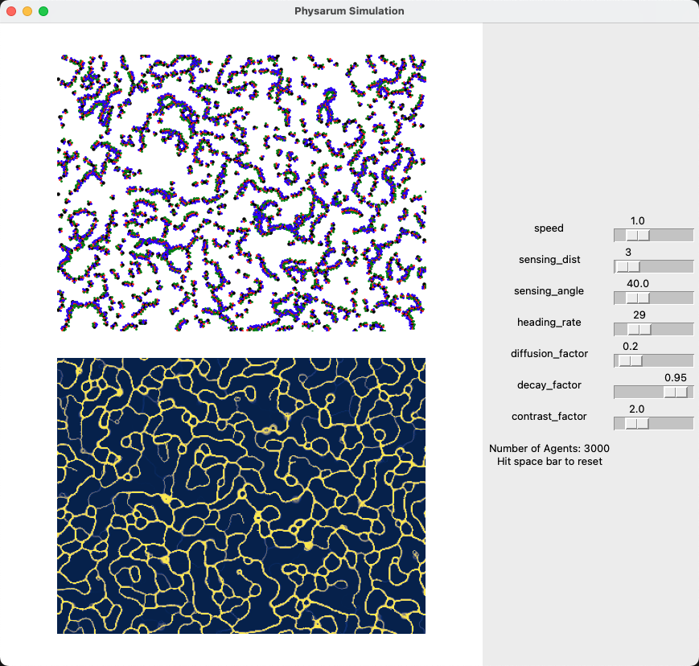

# Physarum Simulation

Dependencies:

- Numpy
- Scipy
- Matplotlib

Run the simulation with the following command:

```bash
python gui.py
```

You should get something like:

<p float="left">
  
</p>